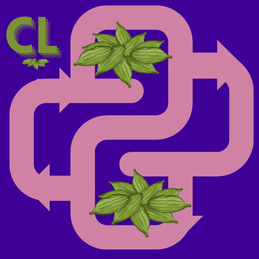

# Cardamon Loops Student Code Repo

This repo is used for students to upload their daily work and weekly project for the teachers and fellow students to see. In this repo each student will have their own branch.

In order to start please follow these steps:

1. register on github
2. please follow Github Workflow: student-code instructions here: [github lesson](https://spiced.space/cardamon-loops/da-course/01-introduction-to-python/github.html)

You should be pushing regularly. At least once at the end of your work day if not more. 
